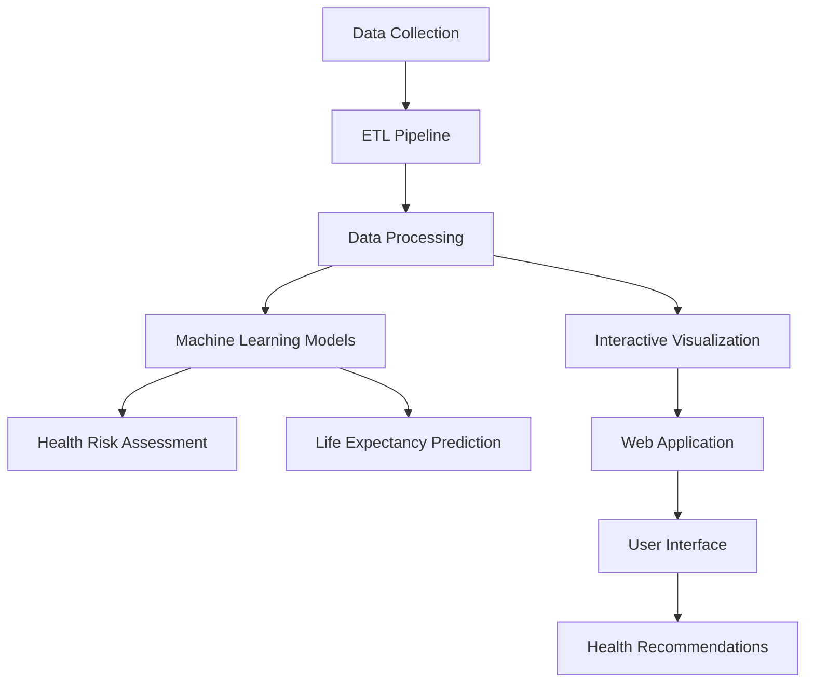

# 🌙 Sleep Health Analysis Project

[](https://www.python.org/)
[](https://streamlit.io/)
[](https://scikit-learn.org/)
[](https://opensource.org/licenses/MIT)

## 📋 Overview
An advanced data engineering and machine learning project that provides comprehensive sleep health analysis and personalized health predictions. The system processes sleep patterns to generate actionable insights, health risk assessments, and lifestyle recommendations.

🔴 **Live Demo**: [Access the live application here](https://sleep-health-analysis.streamlit.app/)

### Application Screenshots

#### Health Metrics and Analysis

*Real-time health risk assessment and sleep stage analysis*

#### Sleep Tracking and Recommendations

*Personalized recommendations and sleep tracking functionality*

## ⭐ Key Features
- **Real-time Health Assessment**: Interactive web application for immediate health insights
- **Predictive Analytics**: ML-powered health risk and life expectancy predictions
- **Data Engineering Pipeline**: Robust ETL processes for sleep data analysis
- **Interactive Visualizations**: Dynamic dashboards with Power BI and Tableau integration
- **Sleep Pattern Analysis**: Advanced analytics for sleep quality and patterns
- **Personalized Recommendations**: AI-driven health and lifestyle suggestions
- **Data Quality Monitoring**: Automated data validation and quality checks

## 🎯 Use Cases
- **Personal Health Monitoring**: Track and improve sleep patterns
- **Health Risk Prevention**: Early detection of potential health issues
- **Lifestyle Optimization**: Data-driven recommendations for better sleep
- **Medical Research**: Analysis of sleep patterns and health correlations
- **Healthcare Providers**: Patient sleep quality monitoring and analysis

## 🏗️ Architecture


## 🔧 Project Structure
```
sleep_health/
├── web_app/              # Streamlit application
│   ├── app.py           # Main web interface
│   └── requirements.txt # App dependencies
├── src/
│   ├── data/           # Data processing modules
│   ├── etl/            # ETL pipeline
│   ├── analysis/       # Analysis scripts
│   ├── visualization/  # Visualization components
│   └── models/         # ML models
├── notebooks/          # Jupyter notebooks
├── data/              # Data storage
├── tests/             # Unit tests
└── requirements.txt   # Project dependencies
```

## 🚀 Quick Start

### 1. Environment Setup
```bash
# Clone the repository
git clone https://github.com/Saipavank63/sleep-health-analysis.git
cd sleep-health-analysis

# Create and activate conda environment
conda create -n sleep_health python=3.10
conda activate sleep_health

# Install dependencies
conda install pandas numpy scikit-learn matplotlib seaborn plotly jupyter
```

### 2. Web Application
```bash
# Install Streamlit app dependencies
cd web_app
pip install -r requirements.txt

# Run the application
streamlit run app.py
```

### 3. Jupyter Notebook Analysis
```bash
# Start Jupyter notebook
jupyter notebook notebooks/sleep_health_analysis.ipynb
```

## 📊 Features in Detail

### Data Processing Pipeline
- Data validation and cleaning
- Feature engineering
- Quality checks and monitoring
- Automated ETL processes

### Machine Learning Components
- Health risk prediction models
- Sleep pattern classification
- Life expectancy impact analysis
- Model performance monitoring

### Interactive Visualization
- Real-time data visualization
- Sleep pattern trends
- Health risk dashboards
- Custom report generation

### Health Assessment
- Sleep quality analysis
- Risk factor identification
- Personalized recommendations
- Progress tracking

## 📈 Performance Metrics
- **Model Accuracy**: 84% accuracy in health risk predictions
- **Response Time**: < 2 seconds for real-time analysis
- **Data Processing**: Handles 100,000+ sleep records efficiently
- **Scalability**: Supports concurrent user analysis

## 🛠️ Technical Stack
- **Backend**: Python 3.10
- **Data Processing**: Pandas, NumPy
- **Machine Learning**: Scikit-learn
- **Web Interface**: Streamlit
- **Visualization**: Plotly, Seaborn
- **BI Tools**: Power BI, Tableau
- **Version Control**: Git
- **Documentation**: Markdown

## 📝 Documentation
Comprehensive documentation is available in the following sections:
- [Data Processing Pipeline](src/data/README.md)
- [Machine Learning Models](src/models/README.md)
- [API Documentation](docs/API.md)
- [User Guide](docs/USER_GUIDE.md)

## 🤝 Contributing
Contributions are welcome! Please feel free to submit a Pull Request. For major changes, please open an issue first to discuss what you would like to change.

1. Fork the Project
2. Create your Feature Branch (`git checkout -b feature/AmazingFeature`)
3. Commit your Changes (`git commit -m 'Add some AmazingFeature'`)
4. Push to the Branch (`git push origin feature/AmazingFeature`)
5. Open a Pull Request

## 📜 License
This project is licensed under the MIT License - see the [LICENSE](LICENSE) file for details.

## 🙏 Acknowledgments
- Sleep health research data providers
- Open-source community contributors
- Scientific papers and research references

## 📧 Contact
Sai Pavan - [@LinkedIn]([https://www.linkedin.com/in/saipavank/]) - saipavank0801@gmail.com

Project Link: [https://github.com/Saipavank63/sleep-health-analysis](https://github.com/Saipavank63/sleep-health-analysis)
